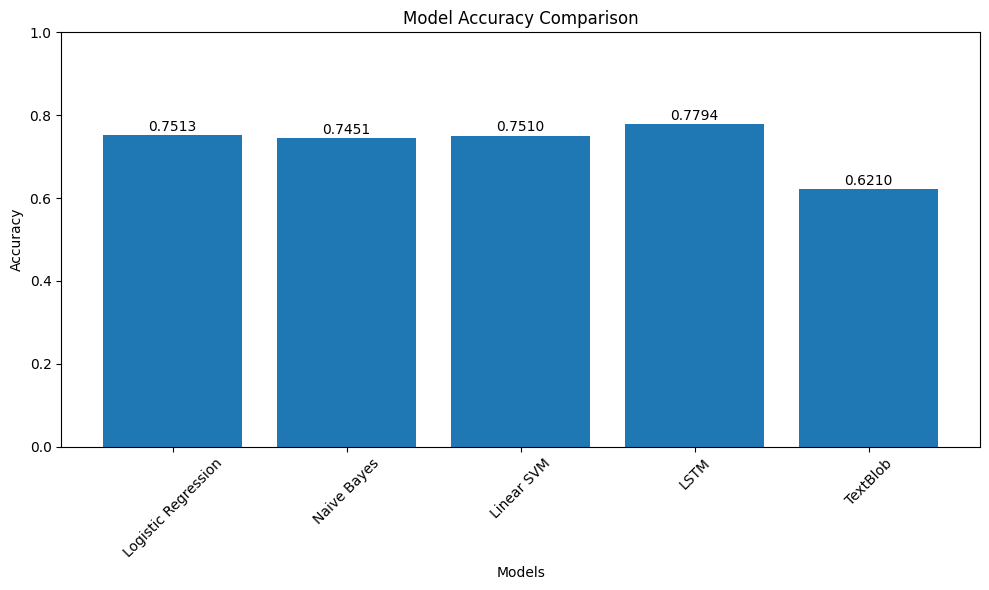

# 🐦 X|Twitter Sentiment Analysis using ML & Deep Learning

## 📌 Overview

This project builds an end-to-end sentiment analysis pipeline for Twitter data using Natural Language Processing (NLP).

It explores multiple approaches—from rule-based methods to machine learning and deep learning—to classify tweets as positive or negative, while also comparing their performance and efficiency.

----

## 🎯 Objectives

- Clean and preprocess real-world tweet data  
- Convert text into numerical representations (TF-IDF, tokenization)  
- Train and evaluate multiple models  
- Compare performance across different approaches  
- Select the most practical model for deployment  

----

## 🧠 Models Implemented

### 🔹 Machine Learning
- Logistic Regression  
- Naive Bayes  
- Linear SVM  

### 🔹 Rule-Based
- TextBlob  

### 🔹 Deep Learning
- LSTM (TensorFlow / Keras)  

----

## 📊 Results Summary

| Model               | Accuracy |
|--------------------|---------|
| Logistic Regression | ~75%    |
| Linear SVM          | ~75%    |
| Naive Bayes         | ~74%    |
| TextBlob            | ~61%    |
| LSTM                | **~78% (Best)** |

----

## 🏆 Best Model for Deployment

Although LSTM achieved the highest accuracy (~78%), the final model selected for deployment is:

**👉 Logistic Regression (TF-IDF based)**

### Why this choice?

- Faster prediction time (low latency)
- Lightweight and easy to deploy
- Requires less computational resources
- Performs nearly as well as LSTM (~75%)

The trained model and vectorizer are saved as:
models/sentiment_model.pkl
models/tfidf_vectorizer.pkl
----

## 🏆 Conclusion

LSTM achieved the highest accuracy (~78%).  
However, Logistic Regression was selected for deployment due to its faster inference time, simplicity, and strong baseline performance.
This reflects a practical trade-off between performance and efficiency.

----

## 📂 Project Structure

Twitter-Sentiment-Analysis/
│
├── data/                 # Dataset files
├── src/
│   ├── data_loader/      # Data loading scripts
│   ├── preprocessing/    # Text cleaning
│   ├── models/           # ML & DL models
│   ├── evaluation/       # Metrics
│   ├── visualization/    # Plots
│
├── models/               # Saved models
├── visuals/              # Generated graphs
│
├── main.py               # Training pipeline
├── predict.py            # Prediction script
├── requirements.txt
└── README.md

----

## ⚙️ Tech Stack

- Python  
- Pandas, NumPy  
- Scikit-learn  
- NLTK, TextBlob  
- TensorFlow / Keras  
- Matplotlib, Seaborn  

----

## 📈 Visualizations

The project generates:

- Model accuracy comparison  
- Confusion matrices  
- LSTM training & validation curves  

Example:

----

## ~ How to Run

### 1️ Install dependencies
pip install -r requirements.txt

### 2️ Train models
python main.py

### 3️ Run predictions
python predict.py

----

## ~ Example Predictions

Input:  "I love this product!"  
Output: Positive 😊  

Input:  "Worst experience ever"  
Output: Negative 😠  

----

## ~ Key Learnings

- TF-IDF works very well with linear models  
- Logistic Regression and SVM are strong baselines  
- LSTM improves accuracy but increases computation cost  
- Model selection should balance performance and efficiency  

----

## ~ Future Improvements

- Deploy using Streamlit or Flask  
- Integrate real-time Twitter API  
- Experiment with transformer models (BERT)  
- Improve neutral sentiment detection  

----

## ~ Author

Priyanka Rathore
----